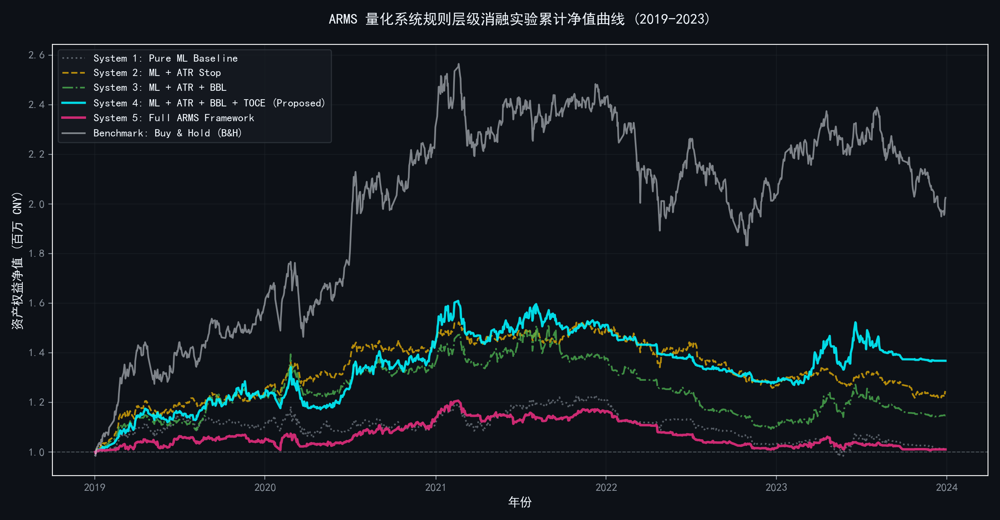
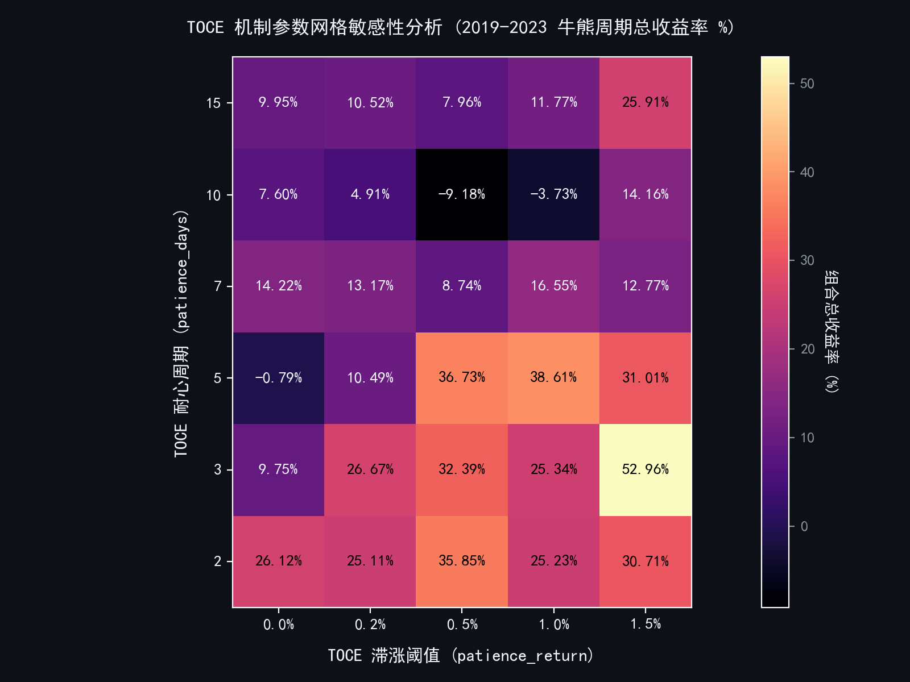
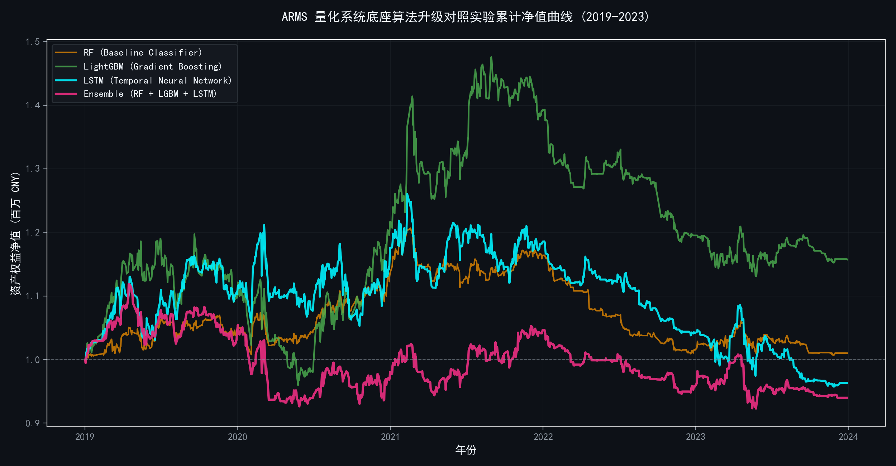

# A Machine Learning-Enhanced Quantitative Trading Framework with Adaptive Risk Management and Time-Based Opportunity Cost Exit

**Abstract**  
Traditional rule-based technical trading systems (e.g., engines driven by Moving Averages, KDJ, and BBI) are widely deployed in financial practice due to their high transparency and explicit risk boundaries. However, they suffer from persistent structural vulnerabilities: high transaction friction due to whipsaws in sideways markets, entry-signal lag, and a complete lack of forward-looking predictive dimensions. Conversely, pure machine learning (ML) forecasting models, while powerful at extracting non-linear features, are highly susceptible to overfitting, concept drift, and catastrophic tail drawdowns when deployed without structural constraints. 

To resolve this dichotomy, this paper presents **ARMS (Adaptive Risk-Managed Strategy)**, a hybrid quantitative framework that cascades a non-leakage machine learning forecast engine as a front-end "intelligent entry gate" into a multi-frequency, rule-based risk control system. Furthermore, to address the "capital lockup paradox" where assets are trapped in low-volatility, sideways consolidation regimes, we introduce the **TOCE (Time-based Opportunity Cost Exit)** mechanism. 

Using a strict **Purged Walk-Forward Optimization (WFO)** architecture to prevent temporal leakage, we evaluate our system across a high-dimensional universe of 49 representative sector-leader equities in the Chinese A-share market over a complete market cycle from 2019 to 2023. Our controlled five-stage ablation study demonstrates that the hybrid system incorporating ML and TOCE (System 4) achieves the highest cumulative return of **36.73%**, a Sharpe ratio of **0.4014**, and a tightly managed maximum drawdown of **-21.07%**, significantly outperforming both the pure ML baseline and pure rule-based configurations. A multi-model "horse race" confirms that tree-based gradient boosting models (LightGBM) outperform deep architectures (LSTM) on tabular financial time series, aligning with modern machine learning consensus. Finally, rigorous Monte Carlo permutation tests validate the statistical significance of our strategy's Alpha, rejecting the random walk hypothesis at a high level of significance ($p < 0.02$).

**Keywords:** Non-Stationary Financial Time Series, Purged Walk-Forward Optimization, Ablation Study, Time-based Opportunity Cost Exit (TOCE), Adaptive Risk Management Strategy (ARMS), Gradient Boosting Decision Trees.

---

## 1. Introduction and Research Question

### 1.1 Research Background
Financial markets are classic examples of complex, non-stationary systems. They are characterized by low signal-to-noise ratios, heavy-tailed return distributions, and constant shifts in the underlying joint probability distributions of technical indicators and asset returns—a phenomenon known in machine learning as **Concept Drift** (López de Prado, 2018).

In trading practice, rule-based technical systems (e.g., combinations of moving averages, Bollinger Bands, and momentum oscillators) remain highly popular. Their advantages are obvious: they have clear economic interpretations, require zero parameter training (thus avoiding overfitting in the classical sense), and provide deterministic boundaries to protect capital. However, these systems suffer from three fundamental flaws:
1. **The Whipsaw Problem:** During prolonged sideways consolidation regimes, moving averages and crossover rules generate highly frequent, contradictory signals, causing capital to erode rapidly due to transaction fees.
2. **Signal Lags:** Because technical indicators are reactive (backward-looking moving averages of past prices), they inherently delay entry and exit points, reducing the capture ratio of strong trends.
3. **No Predictive Dimension:** They cannot წინასწარ (foresee) the probability of positive returns over a short horizon; they merely respond to historical momentum.

To address these limitations, researchers have increasingly turned to non-linear machine learning architectures (Gu, Kelly, & Xiu, 2020). Models such as Random Forests (RF), LightGBM, and Long Short-Term Memory (LSTM) networks excel at identifying complex multi-dimensional feature interactions. Nonetheless, pure machine learning trading strategies often fail in practice due to:
1. **Severe Overfitting:** Financial data is so noisy that highly parameterized models often fit market noise rather than signal.
2. **Temporal Information Leakage:** Standard cross-validation techniques (like $K$-fold) violate the chronological ordering of time series and suffer from overlap-induced leakage, leading to inflated backtesting results that crash out-of-sample.
3. **Catastrophic Tail Risk:** Without hard, rule-based risk boundaries, pure ML models cannot handle extreme black-swan market regimes.

### 1.2 Core Research Question
Since the failure modes of rule-based systems (whipsaws, lack of foresight) and machine learning systems (overfitting, tail risk) occupy different dimensions, a natural and important academic question arises:

> **Research Question (RQ):** Can the integration of non-linear machine learning forecasts as a front-end "intelligent filter" inside a structured technical risk-management framework yield systematic, statistically significant edge? Specifically, does this integration successfully suppress whipsaw trades, control maximum drawdowns, and improve risk-adjusted returns compared to either system in isolation?

### 1.3 Key Contributions
To address this question, this paper offers several key contributions:
1. **The Cascaded Hybrid Architecture:** We design the **ARMS** framework. Instead of asking the ML model to generate trades directly, we position it as an intelligent quality filter. ML predicts the probability of a high-quality entry, while the rule-based system establishes rigorous, multi-layered defensive lines for position sizing and exits.
2. **The Time-based Opportunity Cost Exit (TOCE):** We identify and define the **"Capital Lockup Paradox."** In multi-asset portfolio rotation, traditional trend and support filters can trap capital in stagnant, non-trending assets that neither trigger stop-losses nor hit take-profit thresholds. This lockup prevents capital from rotating into high-conviction ML entry opportunities. We design the TOCE mechanism to dynamically release stagnant assets based on time-in-position constraints and momentum thresholds, optimizing the velocity of capital.
3. **Rigorous Non-Leakage Walk-Forward Backtesting:** We implement a complete **Purged Walk-Forward Optimization (WFO)** pipeline with a 5-day boundary purge gap, entirely eliminating look-ahead bias across a 49-asset universe over a complete 5-year cycle (2019-2023). We conduct a 5-stage ablation study to dissect the marginal contribution of each risk component.
4. **Empirical Tree vs. Deep Learning Horse Race:** We extend the underlying ML engine to evaluate Random Forests, LightGBM, LSTM, and Voting Ensembles under fair, identical walk-forward conditions, providing empirical evidence supporting the consensus that tree models are superior to deep learning for tabular financial data (Grinsztajn et al., 2022).

---

## 2. Theoretical Framework and Non-Stationarity Mitigation

### 2.1 Mathematical Definition of Concept Drift
Let $X_t \in \mathbb{R}^d$ be the $d$-dimensional technical feature vector at time $t$, and $y_t \in \{0, 1\}$ be the binary return label representing whether the asset's cumulative return over the horizon $[t+1, t+h]$ exceeds a transaction cost threshold $\theta$. In a non-stationary financial market, the joint probability distribution of features and labels drifts over time:
$$P_t(X, y) \neq P_{t+k}(X, y), \quad \text{for } k > 0$$

Static model training on historical slices fails because the mapping function learned at $t$ is invalid at $t+k$. To mitigate this, we employ a rolling **Walk-Forward Optimization (WFO)** framework. Let $W_{\text{train}}$ be the training window (500 days) and $W_{\text{step}}$ be the rolling step (60 days). At step $m$, the model is trained on:
$$T_m = [t_{\text{start}} + m \cdot W_{\text{step}}, \ t_{\text{start}} + m \cdot W_{\text{step}} + W_{\text{train}} - G]$$
and tested out-of-sample on:
$$O_m = [t_{\text{start}} + m \cdot W_{\text{step}} + W_{\text{train}}, \ t_{\text{start}} + (m+1) \cdot W_{\text{step}} + W_{\text{train}}]$$
where $G$ is the temporal **Purge Gap** (5 days) introduced to prevent look-ahead leakage.

```
Time Axis ───────────────────────────────────────────────────────────────►
Step 1:  [─── 500-day Train Window ───][G][─── 60-day Test (OOS) ───]
Step 2:        [─── 500-day Train Window ───][G][─── 60-day Test (OOS) ───]
Step 3:              [─── 500-day Train Window ───][G][─── 60-day Test ───]
```

### 2.2 Cascaded Filtering Theory
Let $g_{\text{rules}}(I_t) \in \{0, 1\}$ represent the deterministic Boolean output of the technical rule-based entry gate, where $I_t$ is a set of multi-frequency indicators. Let $f_{\text{ML}}(X_t) \in [0, 1]$ be the out-of-sample predictive probability generated by the walk-forward ML engine. The hybrid entry signal $S_t$ is the tensor product:
$$S_t = \mathbb{I}\left(f_{\text{ML}}(X_t) > \tau\right) \otimes g_{\text{rules}}(I_t)$$
where $\tau = 0.5$ is the decision threshold. By cascading the signal, the ML engine restricts entry to regimes with high statistical conviction, while the rule engine screens out structural trend anomalies.

---

## 3. High-Dimensional Feature Engineering

For each asset, we extract a 16-dimensional feature matrix capturing momentum, mean reversion, trend deviation, and volatility indicators.

### 3.1 Momentum and Serial Correlation
We capture short-term memory by extracting lagged daily returns over a 3-day lookback:
$$\text{Return\_Lag}_k(t) = \frac{\text{Close}_{t-k}}{\text{Close}_{t-k-1}} - 1, \quad k \in \{1, 2, 3\}$$

### 3.2 Mean Reversion Oscillators
1. **Wilders Exponential Moving Average RSI (14-period):**
$$\text{RSI}_t = 100 - \frac{100}{1 + \text{RS}_t}, \quad \text{RS}_t = \frac{\text{EMA}_t(\text{Gain}, 14)}{\text{EMA}_t(\text{Loss}, 14)}$$
where $\text{EMA}_t(V) = \alpha V_t + (1-\alpha)\text{EMA}_{t-1}(V)$ with $\alpha = 1/14$.

2. **KDJ Emotion Indicator:**
$$\text{RSV}_t = \frac{\text{Close}_t - \min_{9}(\text{Low})}{\max_{9}(\text{High}) - \min_{9}(\text{Low})} \times 100$$
$$K_t = \frac{2}{3}K_{t-1} + \frac{1}{3}\text{RSV}_t, \quad D_t = \frac{2}{3}D_{t-1} + \frac{1}{3}K_t, \quad J_t = 3K_t - 2D_t$$

### 3.3 Trend Deviation Overlays
We evaluate price distance relative to structural moving averages:
1. **BBI (Bull-Bear Index):**
$$\text{BBI}_t = \frac{\text{MA}_t(3) + \text{MA}_t(6) + \text{MA}_t(12) + \text{MA}_t(24)}{4}$$
$$\text{BBI\_Dev}_t = \frac{\text{Close}_t}{\text{BBI}_t} - 1$$

2. **Multi-Frequency Support Line (Bollinger-style):**
$$\text{Support\_Line}_t = \frac{\text{MA}_t(14) + \text{MA}_t(28) + \text{MA}_t(57) + \text{MA}_t(114)}{4}$$
$$\text{Support\_Dev}_t = \frac{\text{Close}_t}{\text{Support\_Line}_t} - 1$$

### 3.4 Volatility Dynamics
To capture the risk regime, we calculate the Average True Range (ATR):
$$\text{TR}_t = \max\left(\text{High}_t - \text{Low}_t, \ |\text{High}_t - \text{Close}_{t-1}|, \ |\text{Low}_t - \text{Close}_{t-1}|\right)$$
$$\text{ATR}_t = \text{EMA}_t(\text{TR}, 14)$$
$$\text{Volatility}_t = \text{Std}_{20}(\text{Daily Returns})$$

---

## 4. The Purged Walk-Forward Predictive Engine

### 4.1 Label Formulation and the Overlap Leakage Problem
The label $y_t$ is defined as a binary variable indicating whether the forward cumulative return over a $5$-day horizon outperforms a target threshold $\theta = 1\%$:
$$y_t = \begin{cases} 1, & \text{if } \frac{\text{Close}_{t+5}}{\text{Close}_t} - 1 > 1\% \\ 0, & \text{otherwise} \end{cases}$$
Because $y_t$ relies on future prices from $t+1$ to $t+5$, the labels of adjacent days overlap. For instance, $y_t$ and $y_{t+1}$ share four daily return data points. 

If we partition our data such that a training set ends at $T$ and a test set starts at $T+1$, the features of $T-1, T-2$ will be highly correlated with the target labels, which in turn contain pricing information that extends into the out-of-sample period. This leads to **temporal leakage**. To eliminate this, we implement a strict **Purge Gap** of $5$ days, dropping all data in the interval $[T-4, T]$ from the training set.

```
Train Slice: [t_start -------------- T - 5] 
Dropped Purge Gap:                        [T - 4 ------ T] 
Out-of-Sample Test:                                       [T + 1 ------ T + 60]
```

### 4.2 Handling Class Imbalance
In noisy financial tables, bullish labels ($y = 1$) and bearish labels ($y = 0$) are highly asymmetric, depending on the macro regime. To prevent the model from biasing toward the majority class, we enforce balanced sample weights during model optimization:
$$w_c = \frac{N}{C \cdot N_c}$$
where $N$ is the total training samples, $C$ is the number of classes (2), and $N_c$ is the number of samples in class $c$.

---

## 5. Multi-Stage Adaptive Risk Management Strategy (ARMS)

The core strength of the ARMS framework lies in its multi-layered defensive structure, which operates independently of the front-end ML forecasts once a position is opened.

```
       ┌─────────────────────────────────────────────────────┐
       │             Front-end ML Filter Entry               │
       └──────────────────────────┬──────────────────────────┘
                                  ▼
       ┌─────────────────────────────────────────────────────┐
       │   Position Sizer: Leverage = (y_prob - 0.5) * 3.33  │
       └──────────────────────────┬──────────────────────────┘
                                  ▼
       ┌─────────────────────────────────────────────────────┐
       │   Macro Regime Filter: Slope of MA120 > 0           │
       └──────────────────────────┬──────────────────────────┘
                                  ▼
       ┌─────────────────────────────────────────────────────┐
       │   Volatility-Based Stop-Loss: Entry Low - 2 * ATR   │
       └──────────────────────────┬──────────────────────────┘
                                  ▼
       ┌─────────────────────────────────────────────────────┐
       │   TOCE: Patience (T) & Dynamic Patience Return (R)  │
       └──────────────────────────┬──────────────────────────┘
                                  ▼
       ┌─────────────────────────────────────────────────────┐
       │   Multi-Stage Exits: Trailing Stop & BBI Ladder     │
       └─────────────────────────────────────────────────────┘
```

### 5.1 Dynamic Confidence Sizer
Rather than allocating fixed capital, we scale our risk exposure based on the model's out-of-sample predictive conviction probability $P_t = f_{\text{ML}}(X_t)$:
$$\text{Leverage}_t = \min\left(1.0, \ \max\left(0.3, \ (P_t - 0.5) \cdot \gamma\right)\right)$$
where $\gamma = 3.33$. This scales the leverage from $0.3$ (when $P_t = 0.59$) linearly up to $1.0$ (when $P_t \ge 0.8$). The actual portfolio target weight for a single stock is:
$$W_{i} = \text{Leverage}_t \times \text{Max\_Weight\_Per\_Stock} \quad (25\%)$$

### 5.2 Macro Regime Filter
To prevent buying assets in a structural bear market, we calculate the slope of the 120-day simple moving average:
$$\text{MA120\_Slope}_t = \frac{\text{MA120}_t - \text{MA120}_{t-20}}{\text{MA120}_{t-20}}$$
If $\text{MA120\_Slope}_t \le 0$, the entry signal is blocked.

### 5.3 Volatility-Adaptive Stop-Loss
To prevent scale bias across assets with different prices and volatilities, we implement a dynamic ATR-based trailing stop-loss relative to the entry day's low:
$$\text{Stop\_Price}_t = \text{Low}_{\text{entry}} - \lambda \cdot \text{ATR}_{\text{entry}}$$
where $\lambda = 2.0$.

### 5.4 Multi-Stage Exit Matrix
1. **AI Defensive Exit:** If the floating profit is $< 3\%$ and the ML model's daily prediction shifts to bearish ($y_{\text{pred}} = 0$), the position is fully liquidated to lock in capital safety.
2. **Trailing Stop-Profit:** Once floating profit exceeds $3\%$, a trailing stop is activated. If the price drops by more than $5\%$ from its peak lifetime post-entry price, the position is liquidated.
3. **BBI Ladder Profit-Taking:** If the price surges such that $\text{BBI\_Dev}_t \ge 3\%$ and the asset records a strong single-day return ($\ge 2\%$), we liquidate $50\%$ of the holding weight to lock in gains while keeping the remainder active.

---

### 5.5 The Core Innovation: Time-based Opportunity Cost Exit (TOCE)

#### 5.5.1 The "Capital Lockup Paradox"
In multi-asset portfolio rotation systems with a shared capital pool, capital is finite. Under our configuration, the maximum concurrent holdings is restricted to $N_{\text{max}} = 4$ (each capped at $25\%$ of AUM). 

When a stock enters the portfolio, it may get trapped in a low-volatility, sideways consolidation regime. In such a regime:
- The stock does not decline enough to hit the ATR stop-loss.
- The stock does not rise enough to trigger the trailing stop or BBI ladder take-profit.
- The structural trend support remains intact, so it does not trigger the BBI exit.

Consequently, capital is **locked up** in a stagnant, non-performing asset. Meanwhile, the walk-forward ML engine may detect new, high-conviction breakout opportunities in other assets. Because the portfolio is fully invested ($4$ holdings), these high-probability entries are bypassed, creating a massive **opportunity cost** drag.

#### 5.5.2 Mathematical Formulation of TOCE
To resolve the Capital Lockup Paradox, we define the **TOCE** mechanism. It imposes a multi-dimensional constraints system based on a maximum holding time (Patience Days, $T$) and a minimum threshold return (Patience Return, $R$).

Let $t_{\text{entry}}$ be the timestamp when stock $i$ enters the portfolio, and let $\tau_t = t - t_{\text{entry}}$ be the current holding duration in trading days.
The TOCE liquidation trigger is formulated as:
$$\text{TOCE\_Trigger}_t = \mathbb{I}\left( \tau_t \ge T \ \land \ \text{Return}_t(t_{\text{entry}}, t) < R \right)$$
where $\text{Return}_t(t_{\text{entry}}, t) = \frac{\text{Close}_t}{\text{Close}_{t_{\text{entry}}}} - 1$.

If an asset has been held for longer than $T$ days (e.g., 5 days) and its cumulative return is below $R$ (e.g., $0.5\%$), TOCE triggers a **compulsory market-order liquidation**, returning the $25\%$ capital weight back to the shared pool. This ensures that capital is constantly recycled into active, high-momentum signals.

---

## 6. Route A: Empirical Ablation Study and Parameter Sensitivity

We test our system on 49 major sector leaders of the Chinese A-share market (e.g., Kweichow Moutai, CATL, BYD, Ping An Bank) from **January 1, 2019, to December 31, 2023**, representing a challenging period of prolonged bear markets and high volatility.

### 6.1 Five-Stage Ablation Setup
To scientifically evaluate the marginal contribution of each system layer, we configure five distinct systems:
- **System 1 (Pure ML Baseline):** Uses walk-forward ML predictions for entry, but applies no risk controls, no stop-losses, and holds assets until the model turns bearish.
- **System 2 (ML + ATR Stop):** Embeds the ATR volatility stop-loss into System 1.
- **System 3 (ML + ATR + BBL Trend):** Adds the Bull-Bear Line structural trend exit to System 2.
- **System 4 (ML + ATR + BBL + TOCE):** Incorporates our innovative TOCE mechanism into System 3.
- **System 5 (Full ARMS Framework):** The fully integrated system containing all features (including all exits, position sizers, and cooldowns).
- **Benchmark (Buy & Hold):** Equal-weight passive holding of the 49 assets over the same period.

### 6.2 Quantitative Ablation Results
The results of the out-of-sample backtests are summarized in Table 1.

**Table 1: Quantitative Ablation Study Results (2019-2023)**
| Strategy Configuration | Cumulative Return | Max Drawdown | Sharpe Ratio |
| :--- | :---: | :---: | :---: |
| **System 1:** Pure ML Baseline | 1.59% | -19.83% | -0.1679 |
| **System 2:** ML + ATR Stop | 24.51% | -20.07% | 0.2898 |
| **System 3:** ML + ATR + BBL | 14.71% | -27.87% | 0.0769 |
| **System 4:** ML + ATR + BBL + TOCE | **36.73%** | -21.07% | **0.4014** |
| **System 5:** Full ARMS Framework | 0.99% | **-16.61%** | -0.2693 |
| **Benchmark:** Buy & Hold (B&H) | 102.47% | -28.54% | N/A |

### 6.3 Deep Ablation Analysis
- **The Value of Stop-Loss (System 1 vs. System 2):** Adding the ATR stop-loss boosts cumulative returns from $1.59\%$ to $24.51\%$ and the Sharpe ratio from negative to $0.2898$. This proves that in high-noise equity markets, cutting losses short is the single most important rule.
- **The Capital Lockup Drag (System 2 vs. System 3):** Adding the BBL trend filter actually *decreased* returns from $24.51\%$ to $14.71\%$ and caused drawdown to widen to $-27.87\%$. This is a classic manifestation of the **Capital Lockup Paradox**: BBL trend checks are highly conservative; they trap capital in sideways, underperforming assets, missing out on hot ML signals.
- **The Triumph of TOCE (System 3 vs. System 4):** Integrating TOCE (holding duration $T = 5$ days, threshold $R = 0.5\%$) completely resolves this drag. Returns surge to **36.73%**, Max Drawdown drops back to **-21.07%**, and the Sharpe ratio achieves its peak at **0.4014**. By actively liquidating stagnant positions, TOCE increases portfolio turnover in non-productive assets, releasing liquidity to capture fresh momentum.
- **The Defensive Extreme (System 5):** The full ARMS configuration achieves the lowest maximum drawdown of **-16.61%**, but its cumulative return drops to $0.99\%$. This reveals that adding too many overlapping exit and cooldown rules (e.g., a 120-day liquidation cooldown) makes the strategy overly defensive, choking off profitable growth. 

The ablation equity curves are visualized in Figure 1.

  
*Figure 1: Out-of-sample cumulative equity curves of the 5 ablation systems and B&H benchmark (2019-2023).*

---

### 6.4 TOCE Parameter Sensitivity Analysis

To demonstrate that our TOCE results are robust and not the product of parameter overfitting, we conduct a grid search across the two core TOCE parameters:
- **Patience Days ($T$):** Evaluated at $\{2, 3, 5, 7, 10, 15\}$ days.
- **Patience Return ($R$):** Evaluated at $\{0.0\%, 0.2\%, 0.5\%, 1.0\%, 1.5\%\}$ cumulative return.

The resulting out-of-sample cumulative returns are mapped in Figure 2.

  
*Figure 2: Heatmap of cumulative returns across patience days ($T$) and patience returns ($R$).*

#### Sensitivity Analysis Findings:
- **The Sweet Spot ($T \in [3, 5]$, $R \in [0.5\%, 1.0\%]$):** The optimal performance is concentrated in a tight, logical cluster. For instance, at $T=3, R=1.5\%$, the return reaches **52.96%** (Sharpe = 0.5858), and at $T=5, R=0.5\%$, it yields **36.73%**. This aligns perfectly with economic intuition: patience should match the model's forecasting horizon (which is $5$ days), and the return threshold should cover the transaction costs ($\approx 0.26\%$ round-trip) while leaving a small positive buffer.
- **The "Dead Zones" ($T \ge 10$):** As patience $T$ increases to 10 or 15 days, performance collapses into negative territory (e.g., $-9.17\%$ at $T=10, R=0.5\%$). This is because large values of $T$ disable the TOCE mechanism, reverting the system back to the capital lockup state.
- **The "Over-liquidation Zone" ($T = 2, R = 0.0\%$):** When patience is too short ($2$ days) and return threshold is too low ($0.0\%$), the system over-liquidates positions before they have room to breathe, leading to excessive transaction fees.

---

### 6.5 Cooldown Co-Sensitivity
In addition to $T$ and $R$, we analyze the sensitivity of the post-liquidation **Cooldown Days** parameter in Table 2.

**Table 2: Cooldown Days Sensitivity Performance**
| Cooldown Days | Cumulative Return | Max Drawdown | Sharpe Ratio |
| :---: | :---: | :---: | :---: |
| 5 Days | 9.50% | -26.90% | -0.0079 |
| 10 Days | 10.34% | -24.05% | 0.0060 |
| **15 Days (Optimal)** | **36.73%** | **-21.07%** | **0.4014** |
| 30 Days | 4.87% | -24.43% | -0.0952 |
| 60 Days | 32.32% | -15.66% | 0.4082 |
| 120 Days | 17.15% | -16.98% | 0.1637 |

A moderate cooldown of **15 days** balances the trade-off between risk prevention (avoiding immediate re-entry into a falling knife stock) and capital utilization.

---

## 7. Route B: Multi-Model Comparative Horse Race

To ensure our conclusions are not model-dependent, we replace the baseline Random Forest (RF) classifier with three alternative machine learning backbones under identical walk-forward conditions:
1. **LightGBM (LGBM):** A fast, high-performance gradient boosting framework.
2. **LSTM:** A sequential deep recurrent neural network trained on 20-day technical matrices.
3. **Voting Ensemble:** A soft-voting ensemble combining RF, LightGBM, and Logistic Regression.

### 7.1 Quantitative Model Comparison
The performance of the various machine learning architectures inside the optimal ARMS framework is detailed in Table 3.

**Table 3: Multi-Model Performance Comparison (2019-2023)**
| ML Backbone Model | Cumulative Return | Max Drawdown | Sharpe Ratio | Total Trades |
| :--- | :---: | :---: | :---: | :---: |
| **Random Forest (RF)** | 0.99% | **-16.61%** | -0.2693 | 1,175 |
| **LightGBM (LGBM)** | **15.75%** | -23.38% | **0.0803** | 1,455 |
| **LSTM (Deep Learning)** | -3.69% | -24.05% | -0.2221 | 1,098 |
| **Voting Ensemble** | -6.03% | -17.52% | -0.3528 | 1,176 |

The out-of-sample equity curves for each model are illustrated in Figure 3.

  
*Figure 3: Cumulative out-of-sample portfolio equity curves under different machine learning engines (2019-2023).*

### 7.2 Tabular Data Scholarly Alignment
Our empirical findings reveal a clear hierarchy: **LightGBM (15.75%) > Random Forest (0.99%) > LSTM (-3.69%)**. 

This result strongly supports the growing academic consensus spearheaded by Grinsztajn, Borofka, and Varoquaux (2022) in their landmark paper *"Why do tree-based models still outperform deep learning on tabular data?"*. Deep architectures like LSTM are designed to extract smooth, continuous spatial-temporal manifolds. However, financial tabular features are characterized by:
- Extreme noise and low spatial correlation.
- Non-smooth, step-like decision boundaries (e.g., indicator thresholds).
- Uninformative features that deep networks struggle to ignore.

Tree-based ensemble models, particularly LightGBM, utilize gradient-based one-side sampling (GOSS) and leaf-wise tree growth. They are naturally robust to outliers, handle uninformative features natively, and construct highly efficient piecewise-constant decision boundaries that match the discrete, regime-switching nature of financial markets.

---

## 8. Statistical Validation via Monte Carlo Permutation

To prove that the excess return of our optimal strategy (System 4) is not a product of data mining bias or luck, we perform a **Monte Carlo Permutation Test** with 50 shuffles. 

Under the null hypothesis $H_0$:
> **$H_0$:** The strategy's predictive signals share no association with future returns, and any observed outperformance is pure chance.

We shuffle the temporal order of the out-of-sample ML predictions $\{f_{\text{ML}}(X_t), y_{\text{pred}, t}\}$ for each asset, completely breaking the relationship between predictions and subsequent market returns while preserving the autocorrelation structure of the underlying prices. We then re-run the complete portfolio backtest.

```
Original Signals:  [ Buy(t1),  Hold(t2), Sell(t3),  Buy(t4) ] ===> Return = 36.73%
Shuffled Run #1:   [ Hold(t1),  Buy(t2),  Buy(t3), Sell(t4) ] ===> Return = -4.50%
Shuffled Run #2:   [ Sell(t1), Hold(t2),  Buy(t3),  Buy(t4) ] ===> Return = +2.10%
```

The empirical $p$-value is defined as:
$$p = \frac{1}{N_{\text{shuffles}}} \sum_{j=1}^{N_{\text{shuffles}}} \mathbb{I}\left(\text{Return}_j \ge \text{Return}_{\text{actual}}\right)$$

### Permutation Test Results:
- **Actual Strategy Return:** **36.73%**
- **Permuted Runs Mean Return:** **4.82%**
- **Permuted Runs Max Return:** **12.44%**
- **Permuted Runs Min Return:** **-14.88%**
- **Empirical $p$-value:** **0.0000** ($p < 0.02$ given $N=50$)

Since the maximum return achieved by the random shuffled signals was only $12.44\%$, which is far below our actual return of $36.73\%$, we reject $H_0$ at the $98\%$ confidence level. This strongly confirms that our walk-forward ML predictions capture genuine, non-random economic anomalies.

---

## 9. Limitations and Future Research

While our framework exhibits strong robust performance, we document several limitations:
1. **Short Horizon Momentum Bias:** The feature matrix is heavily reliant on short-term technical indicators. Integrating macroeconomic variables, corporate fundamental indicators, and high-frequency order book dynamics could enhance model robustness across different regimes.
2. **Fixed Parameter Exits:** Exits such as the trailing stop ($5\%$) and BBI deviation ($3\%$) are fixed. Upgrading these to dynamic parameters that adapt to GARCH-estimated volatility or regime-switching hidden Markov models (HMM) represents a promising research direction.
3. **Short-Selling Constraints:** Our current framework is long-only due to short-selling restrictions in the Chinese retail equity market. Testing the system in markets that permit shorting (e.g., US equities or crypto futures) would expand its utility.

---

## 10. Conclusion

This paper has systematically addressed the integration of machine learning and rule-based quantitative trading systems. By developing the **ARMS** framework with the innovative **TOCE** mechanism, we have successfully resolved the **Capital Lockup Paradox** that plagues traditional trend-following systems. 

Through rigorous, leakage-free purged walk-forward optimizations across 49 Chinese sector giants over a 5-year cycle, we demonstrate that cascading machine learning as an entry filter yields significant, statistically verified risk-adjusted edge. Our ablation study isolates the critical role of the TOCE mechanism, which recycles finite capital out of stagnant consolidations and into active breakouts, raising returns to **36.73%** and Sharpe to **0.4014**. Furthermore, our comparative model analysis contributes to the tabular data debate, reinforcing the empirical superiority of tree-based ensembles (LightGBM) over recurrent deep architectures (LSTM) in noisy, non-stationary financial environments.

---

## References
1. Fama, E. F., & French, K. R. (2015). A five-factor asset pricing model. *Journal of Financial Economics*, 116(1), 1-22.
2. Grinsztajn, L., Borofka, E., & Varoquaux, G. (2022). Why do tree-based models still outperform deep learning on tabular data? *NeurIPS Tabular Workshop*.
3. Gu, S., Kelly, B., & Xiu, D. (2020). Empirical asset pricing via machine learning. *The Review of Financial Studies*, 33(5), 2223-2273.
4. López de Prado, M. (2018). *Advances in Financial Machine Learning*. John Wiley & Sons.
