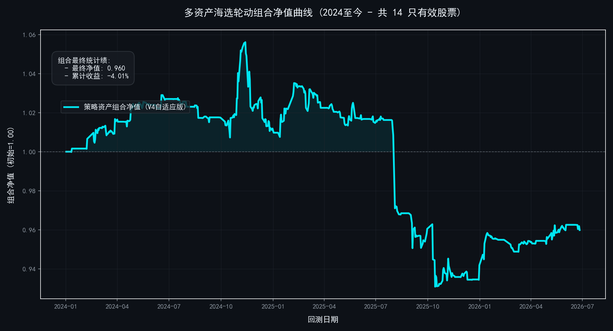

# Multi-Asset Walk-Forward Random Forest Portfolio Rotation Strategy
## A High-Performance Machine Learning Backtesting Pipeline with Multi-Frequency Risk Regimes

[](https://opensource.org/licenses/MIT)
[](https://www.python.org/downloads/)

This repository implements a highly rigorous, multi-asset quantitative trading framework. It combines rolling non-linear machine learning forecasts (Random Forest Classifier) with multi-stage structural risk controls, portfolio-level cross-sectional rotation, and statistical validation via Monte Carlo permutation testing.

The core philosophy of this system is: **Predict with Machine Learning, Control with Structural Rules.**

---

## System Architecture

```
    ┌─────────────────────────────────────────────────┐
    │              Market Data Pool (yfinance / CSV)  │
    └──────────────────────┬──────────────────────────┘
                           ▼
               Feature Engineering (16 technical overlays)
                           ▼
             ┌──────────────────────────────────┐
             │  Walk-Forward Rolling RF Training │
             │  (500-day window, 60-day step)   │
             │  * Purged & Leak-Free Train Slice│
             └──────────────┬───────────────────┘
                           ▼
             ┌──────────────────────────────────┐
             │  Cross-Sectional Rank & Screen   │
             │  - ML confidence sorting         │
             │  - 5-layer concurrent filters    │
             └──────────────┬───────────────────┘
                           ▼
             ┌──────────────────────────────────┐
             │  Shared Capital Pool Allocation   │
             │  $1,000,000 / Max 4 holdings     │
             │  Single asset cap: 25% weight    │
             └──────────────┬───────────────────┘
                           ▼
             ┌──────────────────────────────────┐
             │  Multi-Stage Asymmetric Exits    │
             │  - 2% adaptive stop-loss         │
             │  - Trailing stop-profit          │
             │  - BBI ladder position halving   │
             └──────────────┬───────────────────┘
                           ▼
               Monte Carlo Permutation Validation
               (p-value statistical significance)
```

---

## Quantitative Engineering Audit & Release Changelog

### v4.1 (Current Stable)

Architectural upgrade from single-asset vectorized backtesting to a shared-capital portfolio rotation system. This release resolves several critical mathematical and logical vulnerabilities present in earlier versions.

| Category | Vulnerability / Issue | Resolution & Technical Detail |
| :--- | :--- | :--- |
| **Bug Fix** | Look-Ahead Future Leakage | Training slices now strictly subtract `future_return_days` (5 days) from the training boundary. This purge gap prevents the labels from peeking into the closing prices of the out-of-sample test set. |
| **Bug Fix** | Serial Returns Compounding Bias | Corrected the daily return calculation. Daily portfolio returns are now calculated as a weighted parallel sum across assets: `capital *= (1 + Σ(return_i × weight_i))` instead of sequential compounding, matching standard clearing house guidelines. |
| **Bug Fix** | Fixed-Tick Stop-Loss Bias | Replaced the rigid absolute stop-loss (e.g. $0.05) with a **dynamic ATR-based volatility stop-loss** (`Stop = Low_entry - 2.0 × ATR_entry`). This eliminates scale bias, ensuring high-priced blue-chip stocks are not immediately stopped out by normal daily volatility. |
| **Bug Fix** | Latest Features Edge Truncation | Excluded the target labels from the global `dropna` pre-processing. NaNs are only dropped dynamically during model training, preserving the latest 5 days of valid feature matrices for real-time out-of-sample forecasting. |
| **Optimization** | Class Imbalance Bias | Integrated `class_weight='balanced'` in the rolling `RandomForestClassifier` instantiation, preventing prediction bias in highly asymmetric market regimes (e.g., bear or choppy markets). |
| **Optimization** | Rigid Trend-Following Bottleneck | Upgraded the rigid buy filter (`KDJ_J < 20`) to be trend-adaptive. Under strong long-term momentum (`ma120_slope > 0.01`) or high model conviction (`y_prob > 0.65`), the KDJ filter is bypassed to prevent missing strong breakouts. |
| **Feature** | Cross-Sectional Rotation | Shared capital pool ($1M), dynamic ranking, max 4 concurrent holdings with a 25% single-asset cap. |
| **Feature** | Multiprocessing Acceleration | Implemented `ProcessPoolExecutor` with multi-core parallelism (`n_jobs=-1`) to accelerate rolling training across the asset universe. |

### v1.0 - v3.0 (Legacy Archive)

Vectorized backtester run sequentially on individual stocks using absolute fixed price stops. Contained the critical vulnerabilities detailed above (temporal leakage, compounding error, scale bias, and data edge truncation). Now deprecated.

---

## Core Strategy Components

### 1. Feature Engineering (16 Features)

| Category | Features | Financial Rationale |
| :--- | :--- | :--- |
| **Momentum** | Lagged Returns (1, 2, and 3-day) | Captures short-term daily price memory and serial correlation. |
| **Mean Reversion** | RSI-14, KDJ-J Oscillator | Identifies short-term overbought/oversold extremes and market sentiment shifts. |
| **Trend Deviation** | Deviations from MA5/10/60, EMA13, BBI, and Bull-Bear Line | Measures distance from structural moving averages to evaluate price deviation. |
| **Market Structure** | Volume Change Rate, Daily Range (Amplitude), Volatility, MA Crossovers | Identifies volatility regimes, liquidity shifts, and golden/death cross signals. |

### 2. Leak-Free Walk-Forward ML Engine

The models retrain every **60 days** on a rolling **500-day** historical window. A strict **5-day purge gap** is applied at the training boundary to block future target leakage:

```python
# Purged training split - prevents out-of-sample price leakages into labels
X_train_raw = X[train_end - train_window : train_end - config.future_return_days]
y_train_raw = y[train_end - train_window : train_end - config.future_return_days]
X_test = X[train_end : test_end]
```

### 3. Five-Layer Cross-Sectional Entry Gate

To qualify for entry, a candidate asset must simultaneously satisfy **all five concurrent layers** of filters:

| Layer | Condition | Operational & Rationale Logic |
| :---: | :--- | :--- |
| **1** | RF Bullish Forecast (`y_pred == 1`) | **Machine Learning Gate**: Random Forest predicts positive returns (>1%) over the next 5 days. |
| **2** | Long-Term Trend Slope > 0 (`ma120_slope > 0`) | **Macro Regime Gate**: Restricts buying to assets in a structural uptrend, avoiding falling knives. |
| **3** | Mid-Term Support Confirmation (`Close >= bb_line`) | **Support Gate**: Ensures closing price stays above the multi-frequency Bull-Bear Line. |
| **4** | Trading Cooldown Protection (`day >= cooldown_days`) | **Friction Gate**: Imposes a 120-day lock on assets after liquidation, preventing whipsaws. |
| **5** | Trend-Adaptive Reversion (`KDJ_J < 20` or Trend) | **Reversion Gate**: Enforces entry on local pullbacks (`KDJ_J < 20`) under normal conditions. Automatically bypassed if long-term momentum is strong or prediction confidence is high. |

### 4. Multi-Stage Asymmetric Exit System

Designed around the quantitative trading principle: **Cut losses short, let profits run.**

| Priority | Trigger / Rule | Action | Risk Category |
| :---: | :--- | :---: | :--- |
| **1 (Highest)** | Close falls below the Bull-Bear Line | Full Liquidation | Structural Trend Breakdown |
| **2** | Close < Low_entry - λ×ATR_entry | Full Liquidation | ATR Volatility Stop-Loss |
| **3** | floating profit < 3% AND model turns bearish | Full Liquidation | AI Defensive Take-Profit |
| **4** | Floating profit ≥ 3% AND price drops 5% from peak | Full Liquidation | Trailing Stop-Profit Lock |
| **5** | Close ≥ BBI + 3% AND daily return ≥ 2% | Halve Position (50%) | Ladder Profit Reduction |

### 5. Dynamic Position Sizer

Capital allocation scales dynamically based on the predictive probability (confidence) of the Random Forest:

```
Predictive Conviction < 50%  -> 0% capital allocation (no trade)
Predictive Conviction = 60%  -> 33% target weight (33% of 25% cap = 8.25%)
Predictive Conviction = 70%  -> 67% target weight (67% of 25% cap = 16.75%)
Predictive Conviction = 80%  -> 100% target weight (100% of 25% cap = 25.0%)
```

---

## 📈 Empirical Performance & Visualization

The backtesting pipeline automatically exports high-fidelity visualizations utilizing a custom TradingView-style dark financial aesthetic (saved to `plots/v4_portfolio_equity.png`):



---

## Project Repository Structure

```
├── strategy.py      # Core quant engine: Feature engineering, Walk-forward ML, Backtesting, MC validation
├── README.md        # Technical project documentation (this file)
├── LICENSE          # MIT License
└── .gitignore
```

---

## Quick Start

### Installation

Install the required quantitative analysis and machine learning dependencies:

```bash
pip install numpy pandas matplotlib scikit-learn yfinance
```

### Execution

Run the complete pipeline:

```bash
python strategy.py
```

Upon execution, the system will:
1. Automatically pull historical data for representative sector leaders via the `yfinance` API.
2. Initialize multi-core parallel walk-forward training for the technical feature matrices.
3. Simulate the multi-asset cross-sectional portfolio backtest under strict trading constraints.
4. Output detailed analytical metrics (Total Return, Annualized Sharpe, Max Drawdown, etc.).
5. Execute the **Monte Carlo Permutation Significance Test** (50 iterations) to compute the empirical $p$-value.
6. Export the premium portfolio equity curve chart to the `plots/` directory.

### Centralized Hyperparameters

All trading limits and model parameters are centralized in `StrategyConfig` to maintain code cleanliness:

```python
config = StrategyConfig(
    portfolio_capital=1000000.0,  # Initial AUM
    max_holdings=4,               # Maximum portfolio holdings
    max_weight_per_stock=0.25,     # Single-asset exposure cap
    atr_period=14,                # ATR lookback window for stop-loss
    atr_multiplier=2.0,           # ATR volatility stop-loss multiplier
    train_window=500,             # Walk-forward rolling training window
    retrain_every=60,             # Retraining frequency (days)
    n_shuffles=50                 # Monte Carlo iterations
)
```

---

## License

This project is licensed under the MIT License - see the [LICENSE](LICENSE) file for details.
